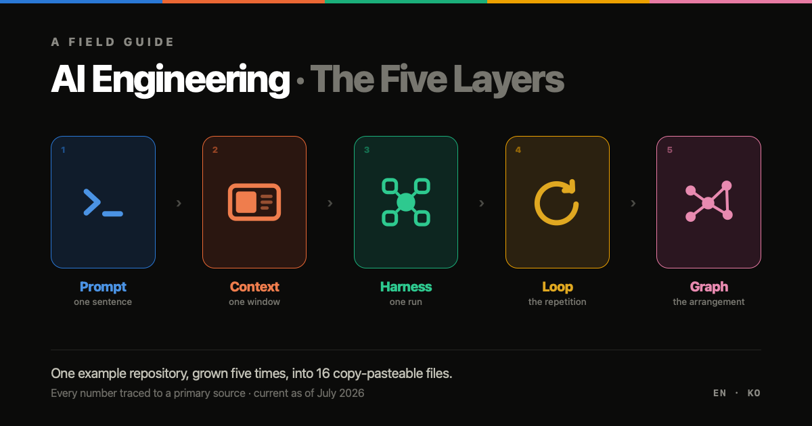
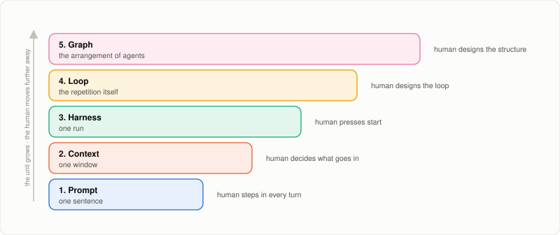
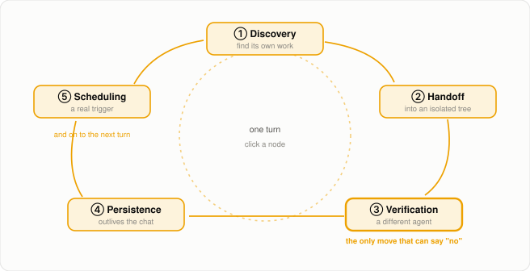
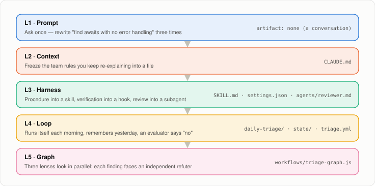
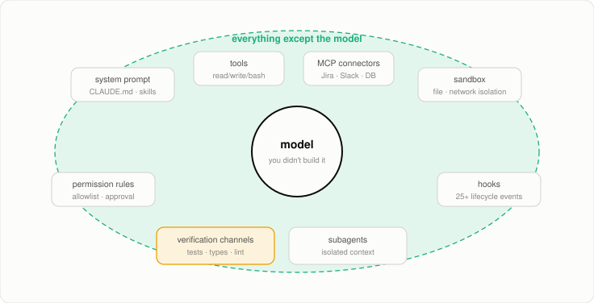

<div align="center">



<br><br>

**A field guide to the five engineering layers of AI-assisted software development.**
One example repository, grown five times, into 16 copy-pasteable files.

[**📖 Read it →**](https://qwerfunch.github.io/ai-engineering-layers/) &nbsp;·&nbsp;
[English](https://qwerfunch.github.io/ai-engineering-layers/en/) &nbsp;·&nbsp;
[한국어](https://qwerfunch.github.io/ai-engineering-layers/ko/)

<sub>~90 min read &nbsp;·&nbsp; +4 h with the exercises &nbsp;·&nbsp; 37 original diagrams &nbsp;·&nbsp; current as of 2026-07-27</sub>

</div>

---

## What this is

Over the last two years, terms ending in *"engineering"* have multiplied at roughly the rate of
model releases. Rolling your eyes is a reasonable response. But these five are not five buzzwords —
they are **one ladder**. Every rung up enlarges the unit you are responsible for, and at the same
time moves you further from the work itself.

> Prompt engineering manages **a sentence**. Context engineering manages **a window**.
> Harness engineering manages **a run**. Loop engineering manages **the repetition itself**.
> Graph engineering manages **how several agents are arranged and connected**.

<picture>
  <source media="(prefers-color-scheme: dark)" srcset="docs/assets/img/layers-dark.svg">
  
</picture>

The guide is written for **working engineers** who are comfortable with git, the CLI and TypeScript,
have used AI coding tools, and have never built a skill, a hook, an agent loop, or a multi-agent
workflow themselves. You do not need to know how a transformer works internally.

It is **not** a model selection guide, a collection of prompt tips, or a benchmark report.
It is about how to build structure. Examples target the Claude Code CLI; the concepts are
tool-agnostic.

---

## The five layers

| # | Layer | Unit of concern | The question it answers | How it fails |
|---|---|---|---|---|
| 1 | **Prompt** | One exchange | What do you say to the model? | Visible on the spot, fixed on the spot |
| 2 | **Context** | One window | What belongs in the window right now? | A confidently wrong answer |
| 3 | **Harness** | One run | How do you equip a single run? | The agent *acts* on a misreading — but the diff is visible |
| 4 | **Loop** | The repetition itself | How do you make it keep going on its own? | A misreading becomes settled fact in a state file |
| 5 | **Graph** | The arrangement of agents | Who does what, in what order, sharing what? | Every node is fine; the conclusion is wrong |

> **The most important sentence in the guide:** the cost of a mistake is proportional to the number
> of turns it survives before someone notices — and a loop is, structurally, a machine for
> maximising the number of turns.

Which is why half the guide is about verification, and why one instruction keeps recurring at every
layer: **put something inside that can say "no."** Only its form changes — explicit constraints at
layer 1, `/clear` at layer 2, tests at layer 3, an independent evaluator at layer 4, provenance and
deterministic gates at layer 5.

<picture>
  <source media="(prefers-color-scheme: dark)" srcset="docs/assets/img/five-moves-dark.svg">
  
</picture>

<div align="center"><sub>Each of the five moves has a matching anti-pattern. Skip verification and you get the most common one: <b>the nodding loop</b> — the agent writes the code, and the same agent declares it good.</sub></div>

---

## What you actually build

Every chapter ends with an exercise. They are not separate examples — it is **the same repository
and the same problem, grown one step at each layer**. Follow all five and you are left with a
complete, working 16-file system.

<picture>
  <source media="(prefers-color-scheme: dark)" srcset="docs/assets/img/exercise-track-dark.svg">
  
</picture>

**The problem:** *"There are places where we `await` without handling errors. We don't know where,
and a human is finding them by hand every time."* Small, verifiable, and requiring judgment about
which ones are actually dangerous.

| Layer | Time | What you end up with |
|---|---|---|
| 1 · Prompt | 15 min | `prompts/find-unhandled.txt` — the same request, rewritten three times, reclaiming one decision each round |
| 2 · Context | 20 min | `CLAUDE.md` — 62 lines, every one of which answers *"what went wrong that added this?"* |
| 3 · Harness | 40 min | A skill, a supporting rules file, three lifecycle hooks, and a read-only reviewer subagent |
| 4 · Loop | 60 min | A scheduled triage loop with a state file, an independent `/goal` evaluator, and three layers of budget ceiling |
| 5 · Graph | 120 min | A fan-out/verify workflow script, plus a four-stage knowledge-graph pipeline |

---

## How to read it

| If you are… | Start here |
|---|---|
| Reading straight through | Chapter 1, running each exercise in a real terminal |
| Debugging something right now | The [diagnostic table in chapter 6](https://qwerfunch.github.io/ai-engineering-layers/en/#p6-diagnose) — most problems live lower than people expect |
| Explaining this to a team | Chapter 0 + chapter 6 + the costs section of chapter 4 |
| Deciding how far to climb | ["How far should you climb?"](https://qwerfunch.github.io/ai-engineering-layers/en/#p6-howfar) — the most common mistake is going too high |

<picture>
  <source media="(prefers-color-scheme: dark)" srcset="docs/assets/img/harness-dark.svg">
  
</picture>

---

## How facts are marked

The guide cites more than thirty specific numbers, so the labelling is split three ways:

| Marking | Meaning |
|---|---|
| *(none)* | The primary source — paper or official documentation — was checked directly. A link is attached. |
| `SECONDARY` | Confirmed in several places, but the original transcript or text could not be verified. |
| `UNVERIFIED` | Verification failed. Read it as a pointer only. |

One worked example of why this matters: the viral *"graph engineering is 18% more accurate and 85%
cheaper"* claim traces back to a paper about **chemical-plant piping diagrams**, measured against
*feeding in the raw image* and *pasting in the whole source file* — nothing to do with replacing
agent loops. The guide walks through that trace and refuses to use the numbers.

---

## Repository layout

```
docs/                         ← GitHub Pages root
├── index.html                ← locale gate: detects the browser language, redirects
├── en/index.html             ← English edition
├── ko/index.html             ← Korean edition
└── assets/
    ├── styles.css            ← one stylesheet, shared by both editions
    ├── app.js                ← one script; all UI strings live in an i18n table
    ├── favicon.svg
    ├── og.png                ← social preview
    └── img/*.svg             ← diagrams extracted for this README (light + dark)
```

Both editions share exactly one stylesheet and one script, and every heading `id` is identical
across languages — so the language switcher preserves your position on the page.

### How the language switch works

1. `docs/index.html` reads `localStorage['ael-lang']`; an explicit choice always wins.
2. Otherwise it walks `navigator.languages` and takes the first `ko` or `en` match.
3. Anything else lands on English. The URL hash is carried across, so deep links keep working.
4. Direct links to `/en/` or `/ko/` are always honoured — no forced redirect.

The in-page switcher (top right) records the choice and hands off to the same anchor in the other
edition.

### Topbar controls

Alongside the language and theme toggles:

- **Star** — links to this repository, with the live star count fetched from the GitHub API and
  cached in `localStorage` for six hours, so a busy day of readers never trips the unauthenticated
  rate limit. If the request fails, the count simply does not appear.
- **Share** — copy link, X, LinkedIn, Hacker News, plus the native share sheet where
  `navigator.share` exists. It shares `location.href`, so a reader who followed a table-of-contents
  link shares the exact section they are on.

### Running it locally

```bash
git clone https://github.com/qwerfunch/ai-engineering-layers.git
cd ai-engineering-layers
python3 -m http.server 8000 --directory docs
# open http://localhost:8000
```

No build step, no dependencies, no framework. It is three HTML files, one stylesheet and one script.

---

## Contributing

This document **is built to be corrected.** If a number has changed or a citation is wrong, open an
issue or a PR. Especially welcome:

- A number that **reads differently** when you check the primary source
- Code that **does not work** when you copy and run it (mention the version)
- The **original source** of anything marked `UNVERIFIED`

Product features — commands, versions, prices — change fast. The items most likely to go stale are
listed in [*"What will go stale fastest"*](https://qwerfunch.github.io/ai-engineering-layers/en/#p7-meta).

If you change the English edition, please check the diagrams: English labels run wider than Korean
ones, and text that overflows a box or a `viewBox` is the most common regression.

---

## License

| | |
|---|---|
| Prose and diagrams | [CC BY 4.0](LICENSE) |
| Code examples | [MIT](LICENSE-CODE) |

Copyright in the quoted material (Anthropic, Addy Osmani, Birgitta Böckeler, Cognition, Microsoft
and others) belongs to the respective authors; it is used here only as attributed quotation, with a
link to each primary source.
